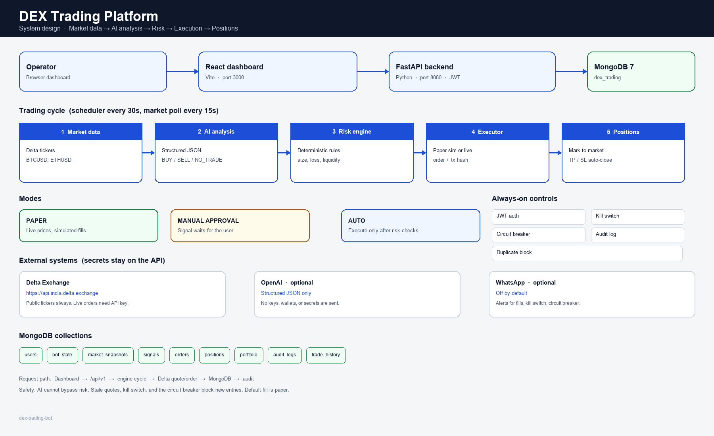

# System design

Architecture diagram for the DEX trading platform.



Full write-up: [SYSTEM_DESIGN.md](../SYSTEM_DESIGN.md)

## Flow

```text
Operator → React dashboard (:3000) → FastAPI (:8080) → MongoDB
                                              ↓
                         Delta tickers → AI analysis → Risk engine → Executor → Positions
```

| Step | What it does |
| --- | --- |
| Market data | Live Delta tickers for gold (`XAUTUSD`), Bitcoin (`BTCUSD`), and Ethereum (`ETHUSD`), stored in MongoDB |
| AI analysis | Structured `BUY` / `SELL` / `NO_TRADE` |
| Risk engine | Deterministic limits. The model cannot skip this step |
| Executor | Paper fill by default. Live orders only when explicitly enabled |
| Positions | Mark to market, then close on take-profit or stop-loss |

Modes: **PAPER**, **MANUAL APPROVAL**, **AUTO**.

Always on: JWT auth, kill switch, circuit breaker, audit log, duplicate-signal block.
